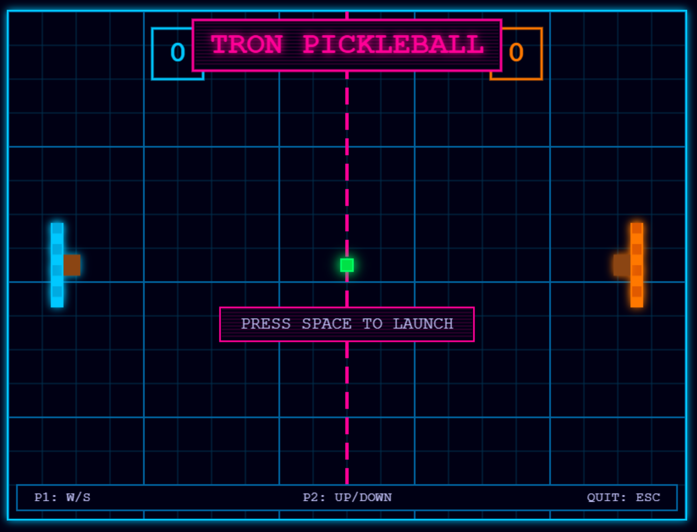

# TRON Pickleball Pong

An 8-bit TRON-inspired version of the classic Pickleball Pong game.

## Game Features

- Retro 8-bit pixel art style
- TRON-inspired neon grid background
- Glowing paddles and ball with particle effects
- Pixelated text and UI elements
- Scanline effects for authentic retro feel
- Particle explosion effects on collisions and scoring

## How to Play

1. **Controls**:

   - **Player 1 (Left/Blue)**: W (up) and S (down)
   - **Player 2 (Right/Orange)**: Up Arrow (up) and Down Arrow (down)
   - **Serve**: Space bar
   - **Quit**: ESC key

2. **Objective**:
   - Score points by getting the ball past your opponent's paddle
   - First player to reach 11 points wins

Enjoy your journey into the TRON-inspired digital world of Pickleball Pong!
